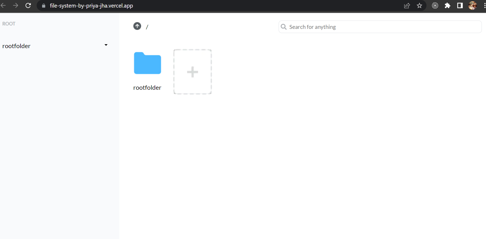

<!-- PROJECT LOGO -->
<br />
<div align="center">
  <a href="https://github.com/Priyajha7585/file-system">
    <!--  -->
    
  </a>

  <h3 align="center">File-System</h3>

  <p align="center">
    An awesome file management system on Web.
    <br />
    <br />
    <a href="https://file-system-by-priya-jha.vercel.app/">View Demo</a>
    ·
    <a href="https://github.com/Priyajha7585/file-system/issues">Report Bug</a>
    <!-- ·
    <a href="https://github.com/othneildrew/Best-README-Template/issues">Request Feature</a> -->
  </p>
</div>

<br/>


<!-- ABOUT THE PROJECT -->
## About The Project

<br/>



<br/>
This is a Fullstack File Management Project.
<br/><br>

Features:<br>
* User can navigate through folders
* User can create unlimited files and folders
* User can view the details of a file or folder
* User can delete the file or folder
* Search functionality is there

<br/>


### Built With
<br/>

* 
* 
* 
* 
* 
* 
* 
* 
* 


<!-- GETTING STARTED -->
## Getting Started

To run this project in your system, please follow the instruction given below

### Prerequisites

Run these commands in your terminal
* npm
  ```sh
  npm install npm@latest -g
  ```

### Installation


1. Go to your terminal
2. Clone the repo
   ```sh
   git clone https://github.com/Priyajha7585/file-system.git
   ```
3. Install NPM packages
   ```sh
   npm install
   ```
4. Run the dev server
   ```sh
   npm run dev
   ```


<!-- CONTACT -->
## Contact

[](priyajha7585@gmail.com)
[](https://www.linkedin.com/in/priyajha7585/)
[](https://github.com/Priyajha7585)
